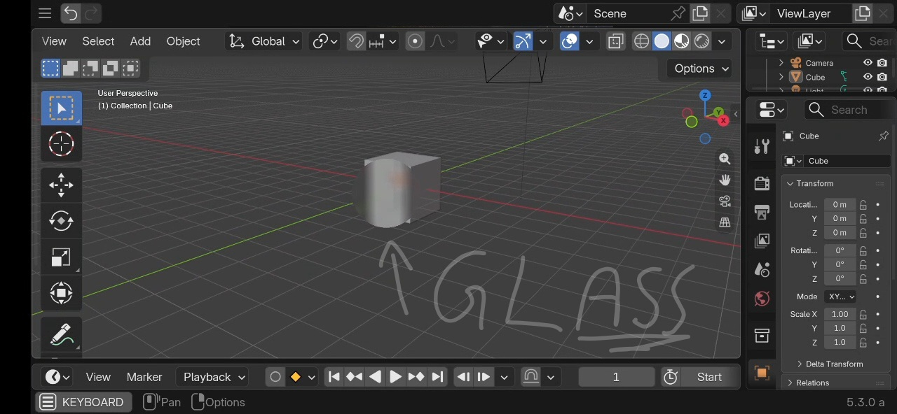

# Blender-5.3-Stable-Buggy-Frosted-Glass
# THIS IS NOT THE CURRENT VERSION OF THE PROJECT.

This is basically the first stable version of 
it.

# What is "Frosted Glass"?

Frosted glass is a striking type of glass, known for its whitish, frosted, and translucent appearance.
In computer graphics, a good starting point is:

Weight = 1; IOR ≈ 1.4; Roughness ≈ 0.5

Don't forget to add a Volume Absorption node to achieve more convincing results, with color distribution based on the volume and its density.

# What's the point of this project?

The goal is to experiment with creating a frosted glass effect in Blender using Python scripting, GPU shaders, and .glsl.
Honestly, I don't even know why I made this project.

But it works.

(sometimes)

# How does it work?
The first version was made using the View3D, capturing its visual output and then applying 
a blur to it.

It's basically blurring the 3D Viewport.

Awful, I know.

The implementation captures framebuffer data from the View3D, processes it using GPU textures and a custom shader, and finally renders the processed result back onto the viewport.

# Usage

Just use it.

jk.

The code contains some simple and direct parameters that can be adjusted:

SIZE = 180

FOV_SCALE = 8.0
BLUR_RADIUS = 16.0

Just adjust them and experiment.
If you're an experienced developer, you can modify the implementation heavily, including positions, dimensions, shaders, and other parameters.

However, keep in mind that changing the glass position can cause it to display only the center of the View3D. This happens because the effect is essentially displaying a portion of the 3D Viewport, which is also why the FOV is intentionally very high.
Newer versions work in a completely different way.

# Known Issues
It doesn't work with Cycles / Path Tracing.
Changing the glass position can cause the displayed area to become misaligned.

The effect is heavily dependent on the View3D.
This is an experimental implementation and may contain bugs.

# Notes

This repository contains an early implementation of the project.

The architecture, rendering method, and overall approach may change significantly in future versions.

If you want to experiment with it, feel free to modify the code and see what happens.

# Modifications & Credit

You are free to modify this project and create your own version based on it.

# If you distribute a modified version, please give credit to the original project and clearly state that your version is based on this project.

# note that this is an old version and anything on it will be changed or updated, so if you want to see new versions, check on my profile for new repositories.